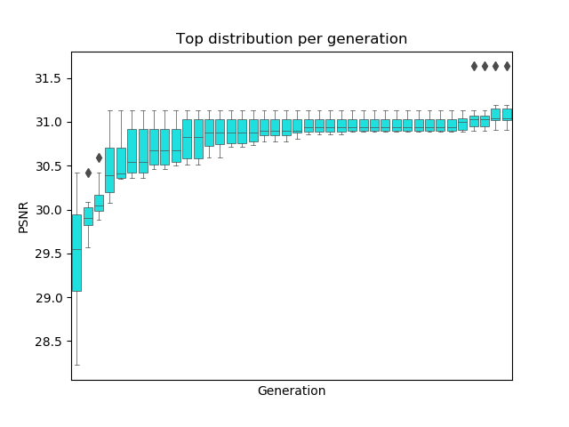

# Neural Architecture Search for Super Resolution UNet architecture

### Based on article https://arxiv.org/pdf/1909.11409.pdf

### Scripts description
- `analysis.py` - script used to create plots _(distribution per generation)_ from log file
- `blocks.py` - module contain block class with the help of which the network is built _(contain parameters responsible for all possible structures of block)_
- `evaluation.py` - module responsible for evaluation of trained models
- `evolution.py` - main script runs the evolutionary training algorithm distributed between several GPUs
- `loss_metric.py` - module contain MSE loss and PSNR metric 
- `sr_data.py` - module responsible for creating Super Resolution datasets from given folders
- `train.py` - training script which forming learning per each GPU, runs by `subprocess` module from `evolution` script
- `UNet.py` - module which create UNet model from given list of blocks

### Example of usage
```console
foo@bar:~/NAS_UNetSR$ python evolution.py --gpus 4
```

### Example of obtained distribution



### TODO
- Do weights sharing between models training
- Try different block structure _(Leaky ReLU, ...)_
